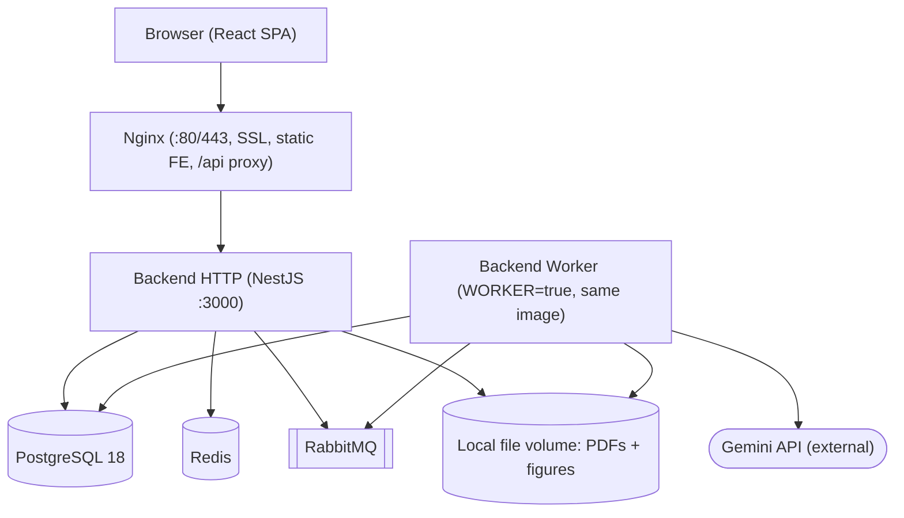
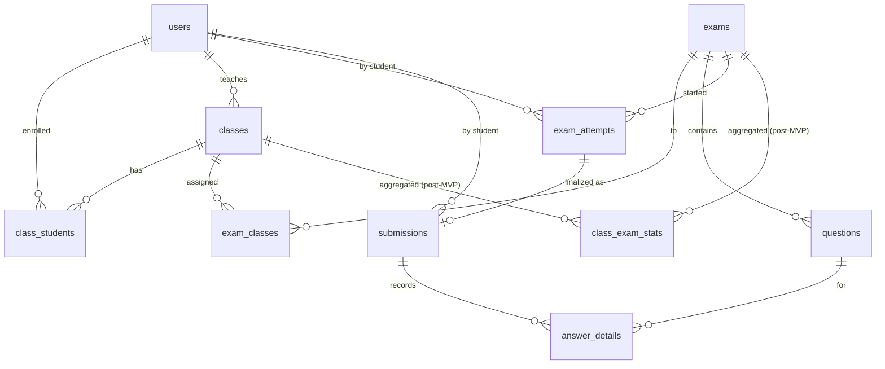

# Architecture Spine — OnThi12

## Design Paradigm

**Modular monolith** — one NestJS module per bounded service, deployed as a single backend image, over **one shared PostgreSQL**. Two shapes cut across it: **lightweight CQRS** (the write side owns transactions; the read side reads a separable projection) and an **async worker** (AI parsing runs off the HTTP path via RabbitMQ). Module boundaries are kept clean enough to split into containers later without a rewrite.

| Layer | Maps to |
| --- | --- |
| Bounded service module | `backend/src/modules/<name>/` — `*.module.ts` / `*.controller.ts` / `*.service.ts` + DTOs. Reference: `auth/`. |
| Cross-cutting | `backend/src/common/` — guards, pipes, filters, interceptors (auth, validation, error envelope). |
| Data access | `backend/src/prisma/` — schema + migrations; the single shared DB. |
| Async worker | Same backend image, separate entrypoint (`WORKER=true`) consuming RabbitMQ. |
| Frontend | `frontend/src/features/<domain>/` + one API client & TanStack Query hooks in `frontend/src/lib/`. |

## Inherited Invariants

Adopted upstream in `docs/PROJECT-STANDARDS.md §3` and the PRD; binding and read-only here — cited by their original IDs, never re-decided.

| Inherited | From | Binds here |
| --- | --- | --- |
| **AD-01** — exam creation only via PDF upload + AI parsing; no manual authoring | PROJECT-STANDARDS §3 | FR-4; no code path creates an exam without an uploaded Source File |
| **AD-02** — AI Parsing is a separate concern, async via queue | PROJECT-STANDARDS §3 | FR-5; realized concretely by AD-13 (async contract), AD-14 (reliability), AD-18 (process split) |
| **AD-03** — lightweight CQRS: Submission (write, transactional) vs Dashboard (read, cached/pre-aggregated) | PROJECT-STANDARDS §3 | FR-16 vs FR-18/21; realized by AD-08, AD-12 |
| **AD-04** — AI never infers a Correct Answer; the teacher confirms | PROJECT-STANDARDS §3 | FR-7, SM-C1; realized by AD-09 gate + AD-05 write ownership |

## Invariants & Rules

Dependency direction — who may call whom (interface calls; acyclic so the monolith splits cleanly). `auth` is enforced cross-cutting via guards, not as a module dependency.

```mermaid
graph TD
  worker["ai-parsing (worker)"] -->|persist / mark| exam
  exam -->|attach classes| class
  submission -->|read exam, questions, status, due_date| exam
  submission -->|read assignment + due_date| class
  class -->|read roster identities| auth
  dashboard -. "read-only CQRS projection" .-> submission
  dashboard -. "read-only" .-> exam
  dashboard -. "read-only" .-> class
```

### AD-05 — Single-writer table ownership

- **Binds:** all modules; the shared PostgreSQL.
- **Prevents:** two modules writing one table, which quietly kills the later container split.
- **Rule:** each table has exactly one owning module and only the owner writes it. `auth`→`users`; `class`→`classes`, `class_students`, `exam_classes`; `exam`→`exams`, `questions`; `submission`→`submissions`, `answer_details`; `dashboard`→`class_exam_stats` (post-MVP). `ai-parsing` owns no tables.

### AD-06 — Cross-module contract: interface-only, with a read-side exception

- **Binds:** every inter-module interaction.
- **Prevents:** hidden coupling (foreign modules reaching into another's tables) that blocks the split.
- **Rule:** a module that needs another module's data or a write goes through the owner's **service interface** (in-process call now, network call after the split) — never a foreign table write. **One exception:** `dashboard` may run **read-only** queries directly over `submissions`, `answer_details`, `exams`, `questions` (the CQRS read side), behind its own query layer — it writes nothing on MVP.

### AD-07 — `questions` has a single writer; re-parse is idempotent

- **Binds:** FR-5, FR-8, FR-9; `exam` + `ai-parsing`.
- **Prevents:** two writers of `questions` and duplicate rows when a parse is retried.
- **Rule:** the worker produces a parsed-result DTO and calls `exam.persistParsedQuestions(examId, result)`; `exam` is the **only** writer of `questions`. Re-parse is allowed **only while Draft** and **replaces all** of that exam's questions atomically in one transaction.

### AD-08 — Dashboard is the read-side; adding cache is non-breaking

- **Binds:** AD-03; FR-18–FR-25; NFR-02.
- **Prevents:** dashboard load leaking onto the submission write path, and a breaking change when caching lands.
- **Rule:** all dashboard reads sit behind `dashboard`'s own query layer. MVP queries source tables directly; swapping in `class_exam_stats` + Redis later must touch **only** `dashboard`. When that pre-aggregation lands, its **sole writer** is a `dashboard`-owned aggregation consumer subscribing to a `submission.recorded` event — `submission` never writes a `dashboard` table, so the read-only CQRS edge is preserved (not reversed).

### AD-09 — Exam lifecycle & the assignment gate (the correctness spine)

- **Binds:** AD-04; FR-4, FR-6, FR-7, FR-9, FR-10, FR-12.
- **Prevents:** an exam going live with an unconfirmed answer or an unreviewed flag — the system's highest-severity failure.
- **Rule:** `exams.status` is a state machine `Draft → Open → Closed`, owned by `exam`; only the exam's teacher triggers `Draft→Open` (assign) and `Open→Closed` (close); **no reopen**. `exam.assign()` is the **single chokepoint** for `Draft→Open` and rejects the transition unless **every** question is assignable: `answer_status ≠ needs_confirmation` **and** (`reviewed_at` is set **or** the question was never flagged). Enforced in the service, not by a DB trigger. Question/answer edits (FR-9) are allowed only while Draft.

### AD-10 — Server-authoritative trust boundary

- **Binds:** FR-1, FR-2, FR-16; every controller.
- **Prevents:** privilege escalation and score tampering from client-supplied fields.
- **Rule:** every controller validates input via a DTO + `ValidationPipe`. `role` is read only from the verified JWT; `score` and `is_correct` are computed **server-side only** and never accepted from the client. Passwords are stored **hashed** (bcrypt/argon2), never plaintext (NFR-03).

### AD-11 — `due_date` is the authoritative submission cutoff

- **Binds:** AD-03; FR-12, FR-16; NFR (UTC+7).
- **Prevents:** needing a scheduler and its missed-flip edge cases; and the UTC+7 off-by-one on date comparison.
- **Rule:** the submission path rejects a submit when `now > due_date` **or** `status ≠ Open`. Manual Close is an *early* stop; there is **no** auto-close job. Every `due_date` comparison uses UTC+7-safe normalization (`Date.UTC(...)` in Prisma / `YYYY-MM-DD::date` in raw SQL) per PROJECT-STANDARDS §9.

### AD-12 — Submission is atomic and idempotent

- **Binds:** AD-03; FR-16; NFR-01, NFR-04 (highest-priority NFR).
- **Prevents:** partial or duplicate submissions when a whole class submits at once.
- **Rule:** a submit writes the `submissions` row and all `answer_details` in a **single transaction**; idempotency is enforced by a **unique constraint on `submissions(student_id, exam_id)`** — a second submit hits the constraint and no-ops rather than writing a second row. Validated for the capstone by a ~40-parallel-submit script asserting exactly-once rows, no partial writes.

### AD-13 — Async parse contract; status lives on `exams`

- **Binds:** AD-02; FR-5, FR-8.
- **Prevents:** any Gemini call on the HTTP request path; loss of parse-progress visibility.
- **Rule:** the `exam` controller receives the PDF → creates a Draft exam (`parse_status = pending`) and stores the file → publishes `{ examId, sourceFileRef }` to RabbitMQ → returns immediately. The `ai-parsing` worker consumes → `exam.markParsing()` → calls Gemini per page → builds the DTO → `exam.persistParsedQuestions()` (or `exam.markParseFailed()`). `parse_status` (`pending|parsing|parsed|failed`) and `parse_error` are columns on `exams`, updated **only** through the `exam` interface.

### AD-14 — Gemini reliability contract

- **Binds:** AD-02; FR-8; NFR-11; SM-5.
- **Prevents:** unbounded retries and lost uploads when the external dependency fails.
- **Rule:** the worker retries **transient** errors (timeout, HTTP 5xx, 429) a small bounded number of times (~3) with exponential backoff + jitter; **non-retryable** errors (quota exhausted, malformed/unreadable file, auth) are not retried and open the circuit. On exhaustion or a non-retryable error: set `parse_status = failed`, **preserve the Source File**, surface a clear teacher-facing message, and expose a manual "retry parsing" action. Never an infinite loop. Only exam-page imagery is sent to Gemini — never student PII (NFR-10).

### AD-15 — Blob storage behind a URL abstraction

- **Binds:** FR-4, FR-8; NFR-11.
- **Prevents:** coupling the code to a storage backend that must change to scale.
- **Rule:** MVP stores the source PDF and cropped figure images on a **local Docker volume** mounted into the backend, served via a static route / Nginx. `exams.source_file_url` and `questions.image_url` stay an abstraction so a later swap to S3/MinIO object storage touches only the storage adapter. **Single-writer namespaces (AD-05 extended to blobs):** the HTTP process writes only `exams/<examId>/source.pdf`; the worker writes only generation-prefixed figure paths `exams/<examId>/gen-<n>/fig-<q>.png` (tied to `parse_generation`, AD-21); all writes are write-temp-then-rename for atomic publish — so the two writers never collide on a path.

### AD-16 — API envelope, error shape, pagination

- **Binds:** all controllers.
- **Prevents:** divergent response/error shapes across independently-built modules.
- **Rule:** base URL `/api`; endpoints kebab-case plural. Success responses are wrapped `{ data, meta? }` by a global interceptor; errors are built by a **single global exception filter** into `{ statusCode, message, error, errorCode? }`. `errorCode` is an **optional** `SCREAMING_SNAKE_CASE` constant, added **only** where one `statusCode` carries multiple business causes the client must branch on — defined centrally in `common/exceptions/error-codes.ts`, never inline. Concretely: the AD-09 assign gate (`EXAM_HAS_UNCONFIRMED_ANSWERS` vs `EXAM_HAS_UNREVIEWED_FLAGS`, both 422) and the AD-11/AD-20 attempt-start gate (`EXAM_NOT_OPEN` vs `EXAM_PAST_DUE`, both 409). Generic errors (validation 400, simple 404) carry **no** `errorCode`; idempotent duplicate submit (AD-12) is a 200 no-op, not an error; AD-14 parse failure is an async `parse_status` field, not this envelope. Unexpected 5xx log full context server-side and return a generic message only — never internal message/stack. Lists paginate via `?page=&limit=` and return `data: [...]` + `meta: { page, limit, total }`.

### AD-17 — Auth: minimal-claim JWT, guards read role from the token

- **Binds:** FR-1, FR-2, FR-3; every protected route.
- **Prevents:** stale-authorization coupling and role spoofing.
- **Rule:** JWT carries **minimal claims** — `sub` (userId) + `role` (`student|teacher`); class membership is **not** in the token (looked up from the DB when needed). A global `JwtAuthGuard` protects routes with `@Public()` opting out (login/reset); a `RolesGuard` + `@Roles()` reads role from the verified token only. The **access token is verified statelessly per request** (no store hit) and stays valid until its **short TTL** expires; a longer-lived **refresh token is stored server-side hashed in Redis** and rotated on use — only the `/refresh` endpoint touches the store. **Logout revokes the stored refresh token only**; the access token lives out its short TTL (the accepted trade-off for statelessness). Password reset uses a separate short-lived token.

### AD-18 — AI parsing runs as a separate worker process

- **Binds:** AD-02; FR-5; SM-5; NFR-08.
- **Prevents:** Gemini latency competing with HTTP request threads; AD-02 being "separate" in name only.
- **Rule:** the RabbitMQ consumer runs as a **separate process from the same backend image** (distinct entrypoint, `WORKER=true`), scalable independently of the HTTP process. Same codebase and modules; only the process boundary differs.

### AD-19 — Rate limiting on the two abuse-prone endpoints (MVP)

- **Binds:** FR-1, FR-5; NFR-09.
- **Prevents:** brute-force login and Gemini daily-quota exhaustion — the one external cost in the critical path.
- **Rule:** a **Redis sliding-window** rate limiter guards **login** (per IP + per account) and the **AI-parse-enqueue** endpoint (per teacher). This is MVP, not deferred (SRS §9.6). A rejected request returns 429; the limiter never blocks the submission path.

### AD-20 — An exam attempt is a first-class entity with a snapshot deadline

- **Binds:** FR-14, FR-16; NFR-01, NFR-04, SM-C2.
- **Prevents:** a legitimate in-flight attempt being voided by a later Close or an earlier `due_date` (a lost submission — the forbidden outcome).
- **Rule:** starting an exam creates an `exam_attempts` row (`student_id`, `exam_id`, `started_at`, `deadline_at`, `status: in_progress|submitted`) with **`deadline_at = min(started_at + duration, due_date)` snapshotted at start** — the server-authoritative timer. A submit (manual or auto) is accepted whenever `now ≤ deadline_at`, **regardless** of a later Close or `due_date` change; AD-11's cutoff gates only the *start* of an attempt, never a submit within an already-open attempt. One `in_progress` attempt per (student, exam); the Submission (AD-12) is created from it.

### AD-21 — Exam-mutation concurrency & parse fencing

- **Binds:** AD-07, AD-09; FR-5, FR-6, FR-7, FR-9, FR-10.
- **Prevents:** two TOCTOU races that each produce the forbidden state — an Open exam containing a `needs_confirmation` question, or a parse result clobbering teacher edits / a newer parse.
- **Rule:** every write to an exam's `status` or its `questions` takes a **row-level lock on the `exams` row**. `exam.assign()` locks, **re-validates the gate in the same transaction**, then flips to Open — so no Draft-legal edit can slip between check and commit. Question writes (teacher edit *or* worker persist) are **rejected once `status ≠ Draft`**, and teacher edits are locked while `parse_status = parsing`. Each parse carries a monotonically increasing **`parse_generation`**; `persistParsedQuestions` applies **only if its generation matches the exam's current generation** — a stale/superseded worker result is discarded, never written.

### AD-22 — Delivery & migration safety

- **Binds:** NFR-05, NFR-08; all deploys.
- **Prevents:** an un-gated or unrecoverable production change.
- **Rule:** GitHub Actions CI (lint + test + build) **gates every merge to `main`**; deploy triggers on `main`. Prisma migrations are **reversible**; a **DB backup is taken before any production migrate**; **rollback = redeploy the previous image tag**. Availability is prioritized for the real exam window (weekday evenings ~19:00–22:00, NFR-05).

## Consistency Conventions

| Concern | Convention |
| --- | --- |
| Naming — FE files | kebab-case (`exam-editor.tsx`); feature folders by domain. |
| Naming — BE files | kebab-case + NestJS suffix (`exam.service.ts`, `exam.controller.ts`). |
| Naming — types / methods | PascalCase types/classes (`ExamService`, `QuestionDto`); camelCase methods (`extractQuestions`). |
| Naming — DB | snake_case, plural tables (`answer_details`); snake_case columns (`answer_status`). |
| Naming — API | `/api`, kebab-case plural (`/api/exams`, `/api/submissions`). |
| IDs & dates | Server-generated ids; `@db.Date` columns compared UTC+7-safe (AD-11). `created_at`/`updated_at` where useful. |
| Score scale | `submissions.score` is on a **0–10** scale (Vietnamese grading), one decimal; computed server-side (AD-10). |
| Low-confidence flag | A question is flagged low-confidence when `ai_confidence < AI_CONFIDENCE_LOW_THRESHOLD` — a **single** backend config value owned by `exam`, so the FR-6 yellow flag and the AD-09 gate use the *same* threshold and never disagree. |
| Response / error envelope | `{ data, meta? }` success; `{ statusCode, message, error, errorCode? }` error (`errorCode` only for multi-cause business errors — AD-16); `?page=&limit=` pagination (AD-16). |
| State mutation | Only the owning module writes its tables (AD-05); cross-module via interface (AD-06); status transitions only through the owner's state-machine method (AD-09). |
| Auth | JWT verified per request; role from token; guards on every protected route (AD-10, AD-17). |
| Validation | DTO + `ValidationPipe` at every controller boundary; never trust client `role`/`score`/`is_correct` (AD-10). |
| Secrets / config | 12-factor env; `GEMINI_API_KEY`/`JWT_SECRET`/DB creds backend-only, never in the frontend bundle, never committed; `.env.example` committed. |
| Frontend data access | One API client in `lib/`; no ad-hoc `fetch` in components. Server state via TanStack Query hooks — `useQuery` for every GET, `useMutation` for every write that invalidates cached data. Narrow exception: pre-auth forms with no cached state to read or invalidate (login, forgot/reset-password) may use `apiFetch` + local `useState`; no new exceptions from Epic 2 onward. |
| Semantic colors | green = good/high · yellow = low-confidence (FR-6) · **red = missing answer (FR-7)** — kept distinct (SRS §5.3). |

## Stack

Pinned current at authoring (2026-07-15); the code owns this once it exists. Node/NestJS/React/PostgreSQL versions are user-authoritative.

| Name | Version |
| --- | --- |
| Node.js | 24.x (LTS) |
| TypeScript | 5.9.x (deliberate hold — TS 7.0 is GA but tooling/eslint not yet caught up) |
| NestJS | 11.x (Node ≥20, Express v5 default, SWC) |
| Prisma ORM | 7.x (rust-free) |
| PostgreSQL | 18.x |
| Redis | 8.x |
| RabbitMQ (+ amqplib) | 4.x |
| React | 19.x |
| Vite | 8.x |
| TailwindCSS + shadcn/ui | 4.x |
| TanStack Query | 5.x |
| Recharts | current |
| @google/genai (Gemini Flash / Flash-Lite) — Google's supported SDK; the older `@google/generative-ai` is EOL | current |
| Nginx · Docker Compose · GitHub Actions | current |

## Structural Seed

### Container / deployment view



### Core entities (names + relationships; invariant attributes noted)



Invariant attributes (not just shape): `exams.status` (Draft/Open/Closed — AD-09), `exams.parse_status` + `parse_error` + `parse_generation` (AD-13, AD-21), `exams.source_file_url` (AD-15); `exam_classes.due_date` (AD-11); `questions.correct_answer` **nullable**, `questions.answer_status` (`ai_extracted|needs_confirmation|manually_confirmed`), `questions.reviewed_at` (**nullable — flag acknowledgement, AD-09**), `questions.options` (JSON), `questions.ai_confidence`, `questions.image_url` (AD-15); `exam_attempts.deadline_at` (**snapshot server timer, AD-20**), `exam_attempts.status`; **unique `exam_attempts(student_id, exam_id)` on one in_progress** and **unique `submissions(student_id, exam_id)`** (AD-12/AD-20); `submissions.score` 0–10. Indexes: `submissions(student_id, exam_id)`, `questions(exam_id)`, `exam_attempts(student_id, exam_id)`. No topic/type tag column in v1.1.

### Source tree (scaffold, not a mirror)

```text
Web_OnThi12/
  backend/
    src/
      modules/{auth,exam,ai-parsing,submission,dashboard,class}/   # one bounded service each
      common/            # guards, pipes, filters, response interceptor
      prisma/            # schema.prisma + migrations
      main.ts            # HTTP entrypoint
      worker.ts          # WORKER=true entrypoint (RabbitMQ consumer)
  frontend/
    src/{features,components/ui,lib,routes}/
  docker-compose.yml     # nginx · api · worker · postgres · redis · rabbitmq
  .env.example
```

## Capability → Architecture Map

| Capability / Area | Lives in | Governed by |
| --- | --- | --- |
| FR-1–3 Auth & role access | `auth` | AD-10, AD-17, AD-19 |
| FR-4, FR-9–12 Exam create / edit / assign / close | `exam` | AD-05, AD-07, AD-09, AD-11, AD-15, AD-21 |
| FR-5, FR-8 Async parsing & figure crop | `ai-parsing` worker → `exam` | AD-02, AD-07, AD-13, AD-14, AD-15, AD-18, AD-19, AD-21 |
| FR-6, FR-7 Flag / missing-answer gating | `exam` | AD-04, AD-09, AD-21 |
| FR-13–17 Take & auto-grade | `submission` (+ read `exam`) | AD-06, AD-10, AD-11, AD-12, AD-20 |
| FR-18–23 Dashboards (student/teacher) | `dashboard` (read-side) | AD-03, AD-06, AD-08 |
| FR-24–26 Class management | `class` | AD-05, AD-06 |
| Cross-cutting: envelope, errors, config, rate limit, CI/CD | `common/` + CI | AD-10, AD-16, AD-19, AD-22 |

## Deferred

- **Pre-aggregated `class_exam_stats` + Redis dashboard cache** — MVP queries source tables directly; add when a dashboard breaks the 2s bar or a class exceeds ~30 exams (SRS §9.1). Non-breaking by AD-08: the writer is a `dashboard`-owned aggregation consumer of a `submission.recorded` event (submission publishes fire-and-forget; it never computes stats or writes `dashboard` tables).
- **Object storage (MinIO/S3)** — deferred behind AD-15's URL abstraction until scale/HA needs it.
- **Batch multi-page Gemini calls / worker fan-out** — deferred until >5 concurrent teacher imports (SRS §9.2).
- **Splitting Submission/Dashboard into independently deployed services** — the paradigm keeps boundaries clean for this; do it at >3–4 concurrent exam windows (SRS §9.3).
- **Horizontal scaling + Postgres read replica** — past 200 concurrent users / sustained >80% VPS load (SRS §9.4).
- **Prometheus/Grafana observability + per-service `/health` fan-out** — start once real users exist (SRS §9.5).
- **Password-reset email provider (FR-3)** — SMTP/provider choice open; a stub is acceptable for the evaluation (PRD Open Question 1).
- **Advanced/predictive at-risk detection** — v1 at-risk is a simple heuristic (SRS DASH-04, NFR-06).
